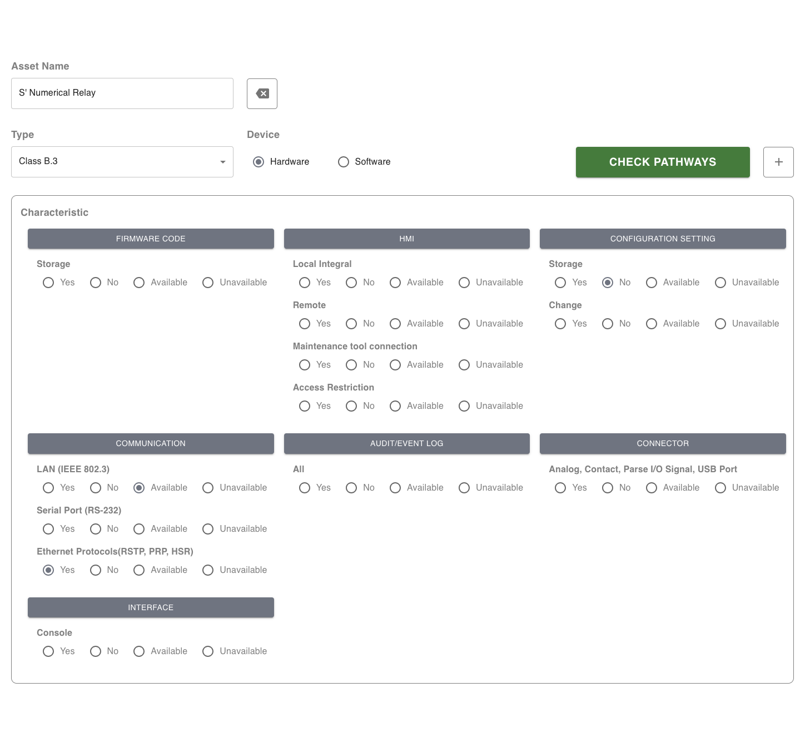
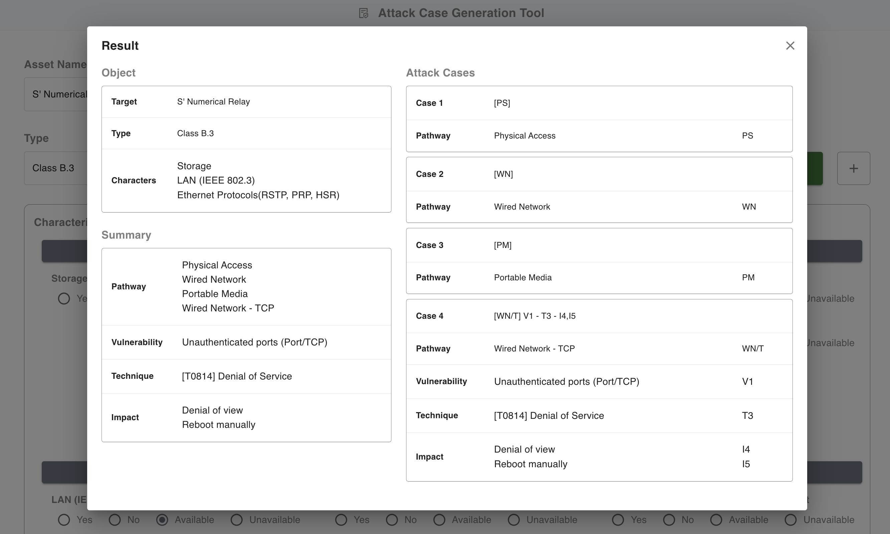
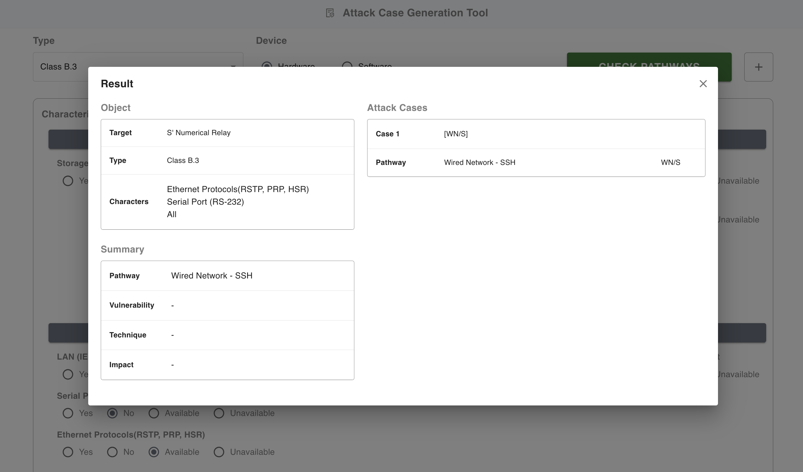
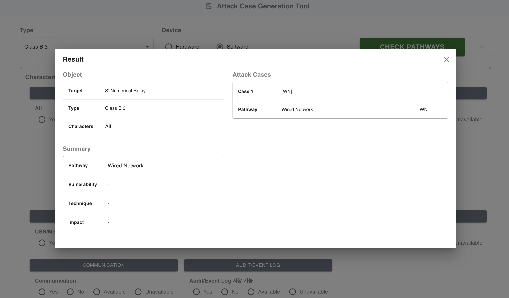
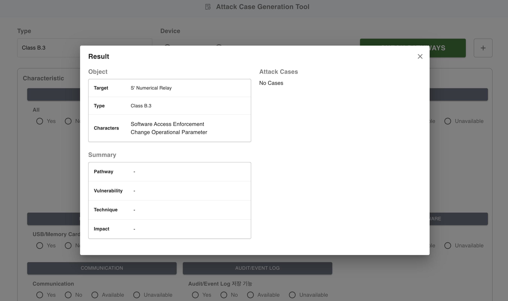

## Attack Case Generation Tool

---

### Set up

```
npm install
npm run dev
```

### Features

### Usage

##### [Attack Case Creation]

1. Enter the name of the asset you wish to add.
2. Choose the asset type.
3. Choose the device type.
4. Select characteristics.
5. Check the generated scenario.
6. If there are vulnerabilities, attack methods, or impacts to add, proceed with the 'setting'.

##### [Attack Case Management]

1. Click on the '+' symbol.
2. Enter the type of data, name, and description you wish to add.
3. Input the data you wish to map. (For pathway select characteristic, for vulnerability select pathway, for technique select vulnerability, for impact select technique).

### Preview

##### Attack case Creation










